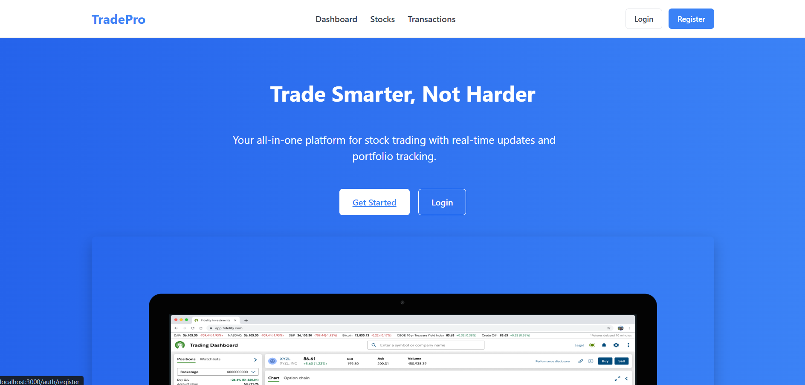

# TradePro - Web Trading Platform

TradePro is a full-featured web-based trading platform that allows users to manage portfolios, buy and sell stocks, track performance, and manage their wallet. This application provides a comprehensive trading experience with real-time data visualization and user account management.

## Screenshots

### Authentication Screens
<div style="display: flex; gap: 10px;">
  
  
</div>

*Secure authentication with login and registration screens*

### Main Interface
<div style="display: flex; gap: 10px; margin-bottom: 10px;">
  
  
</div>

*Landing page and personalized dashboard for users*

### Trading Features
<div style="display: flex; gap: 10px; margin-bottom: 10px;">
  
  
</div>
<div style="display: flex; gap: 10px;">
  
  
</div>

*Full trading functionality with stock listings, detailed views, portfolio management, and market insights*

### Financial Management
<div style="display: flex; gap: 10px;">
  
  
</div>

*Manage your funds with wallet operations and track all transactions*

### User Profile


*Personalize your account and update your profile settings*

### Admin Panel
<div style="display: flex; gap: 10px; margin-bottom: 10px;">
  
  
</div>
<div style="display: flex; gap: 10px;">
  
  
</div>

*Administrative controls for managing users, stocks, and platform operations*

## Features

- **Stock Trading**: Buy and sell stocks with real-time price updates
- **Portfolio Management**: Track your investments and performance
- **User Authentication**: Secure login and registration system
- **Wallet Management**: Deposit and withdraw funds
- **Transaction History**: Review all your trading activity
- **Profile Management**: Personalize your account with profile pictures
- **Market News**: Stay updated with the latest financial news
- **Responsive Design**: Works on desktop and mobile devices

## Technology Stack

- **Frontend**: HTML, CSS, JavaScript, EJS templating
- **Backend**: Node.js, Express.js
- **Database**: MySQL
- **Authentication**: Session-based authentication with bcrypt
- **File Upload**: Multer for handling profile picture uploads
- **UI Components**: Custom CSS framework with responsive design

## Project Structure

```
trading-platform/
├── db.js                  # Database connection setup
├── public/                # Static assets
│   ├── css/               # Stylesheets
│   ├── img/               # Images and media
│   └── uploads/           # User uploads (profile pictures)
├── routes/                # Route handlers
│   ├── admin.js           # Admin panel routes
│   ├── auth.js            # Authentication routes
│   ├── dashboard.js       # Dashboard routes
│   ├── portfolio.js       # Portfolio management
│   ├── profile.js         # User profile routes
│   ├── stocks.js          # Stock trading routes
│   ├── transactions.js    # Transaction history
│   └── wallet.js          # Wallet management routes
├── views/                 # EJS templates
│   ├── admin/             # Admin panel views
│   ├── auth/              # Login and registration
│   ├── layouts/           # Page layouts
│   ├── partials/          # Reusable components
│   ├── portfolio/         # Portfolio views
│   ├── profile/           # User profile views
│   ├── stocks/            # Stock trading views
│   ├── transactions/      # Transaction history
│   └── wallet/            # Wallet management views
├── app.js                 # Main application file
└── package.json           # Dependencies and scripts
```

## Key Components

### Authentication System
- Login/Registration with email verification
- Password encryption with bcrypt
- Session-based authentication

### Stock Trading Module
- Real-time stock data
- Buy/sell functionality
- Position tracking
- Price charts and visualizations

### Wallet Management
- Deposit and withdrawal
- Balance tracking
- Transaction history

### User Profile
- Profile information management
- Profile picture upload
- Password management

### Admin Panel
- User management
- Stock data management
- Transaction oversight

## How to Run

### Prerequisites
- Node.js (v14 or higher)
- MySQL (v5.7 or higher)

### Database Setup
1. Create a new MySQL database named `trading_new`
2. Run the SQL script in `database/schema.sql` to set up the tables

### Installation

1. Clone the repository
```bash
git clone https://github.com/yourusername/trading-platform.git
cd trading-platform
```

2. Install dependencies
```bash
npm install
```

3. Configure environment variables
Create a `.env` file in the root directory:
```
DB_HOST=localhost
DB_USER=root
DB_PASSWORD=yourpassword
DB_NAME=trading_new
SESSION_SECRET=yoursecretkey
PORT=3000
```

4. Create upload directories
```bash
mkdir -p public/uploads/profile
```

5. Start the application
```bash
npm start
```

6. Access the application
Open your browser and navigate to `http://localhost:3000`

### Demo Credentials
- **Regular User**:
  - Email: demo@example.com
  - Password: password
- **Admin User**:
  - Email: admin@tradepro.com
  - Password: admin123

## Development

To run the application in development mode with auto-restart:
```bash
npm run dev
```

## License

This project is licensed under the MIT License - see the LICENSE file for details.

## Acknowledgements

- Stock data visualization powered by Chart.js
- Icons by Font Awesome
- Demo data provided for educational purposes only 